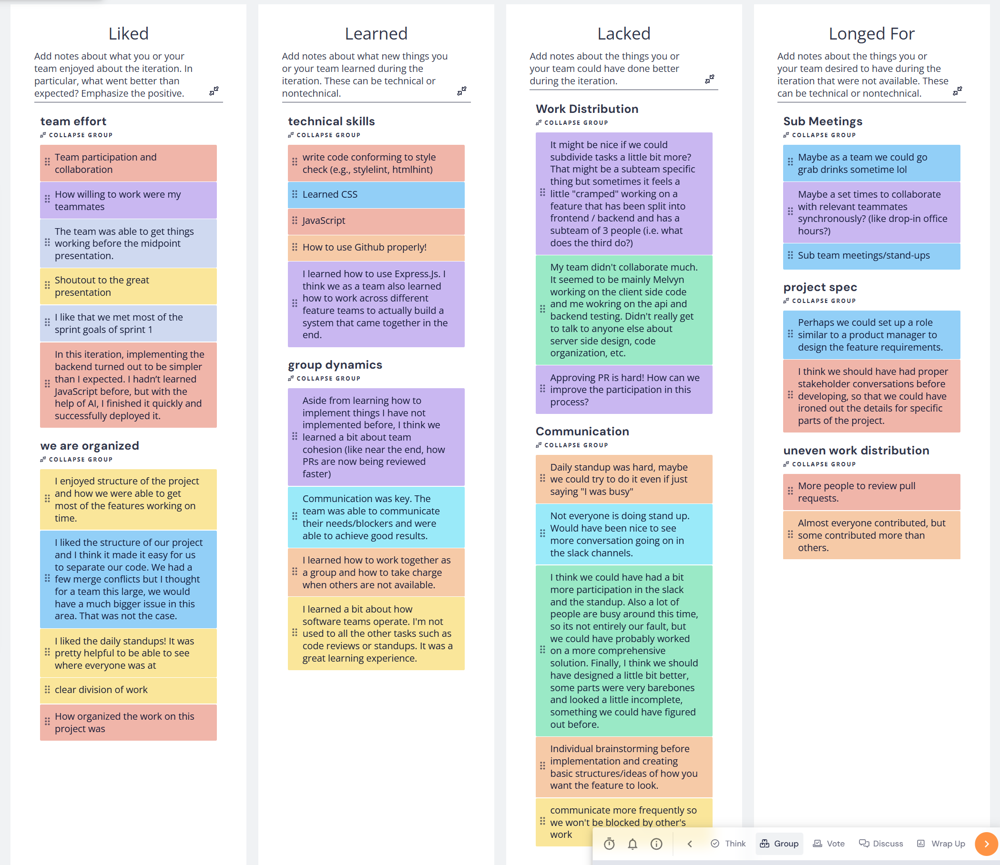

# Retrospective Meeting 11/14/2025  
**Time:** 3:10pm - 3:45pm  
**Scriber:** Alex  
**Attendance:** Melvyn, Isheta, Tej, Akshay, Jared, Alex, Tongke, Patryk, Lei Hu, Siri   

---

## Agenda
- **Retro Board:** [Retrium Board](https://app.retrium.com/team-room/579f9062-5fd4-45ae-b6a8-b0bd3a3ef8a0/retro)  
- **Recording:** [YouTube Link](https://www.youtube.com/watch?v=d05RzjiGP6w)  
- **Retrospective Method:** 4Ls (Liked, Learned, Lacked, Longed For)  

---

## Top Votes and Discussion Points

### Communication (27%)
- More participation needed  
- Daily stand-ups were difficult to maintain  

### Team Effort (13%)
- Participation improved  
- Met most sprint goals for Sprint 1  

### Work Distribution (13%)
- Tasks could be divided more evenly  
- Consider **pair programming**  
- Need to approve more pull requests  

### Sub Meetings (13%)
- More in-person bonding needed  
- Idea: **drop-in office hours** — post in Slack when starting to work so others can join  

### Group Dynamics (10%)
- Overall team morale strong, but coordination can be improved  

### Project Spec (10%)
- Suggest having a **product manager** or more frequent **stakeholder discussions** (with professor)  

### Other Notes
- Team is **well organized**  
- Everyone **learned new technical skills**  
- Acknowledged some **uneven work distribution**  

---

## Action Plan
1. Increase frequency of **stand-ups**, even when there are no major updates  
2. Schedule more **sub-team meetings** and encourage Slack communication  
3. Announce when working on the project to promote **drop-in collaboration**  
4. Each member should aim for **two pull requests per week**  
5. Plan a **team bonding session (dinner)**  
6. Schedule a **meeting with Prof. Powell** to show progress and get feedback  
7. Use the **#stakeholder-qna** Slack channel for professor-related questions  

---

## Screenshots
Please watch the recording for the other phases discuss as they cannot be captured easily with screenshots.

