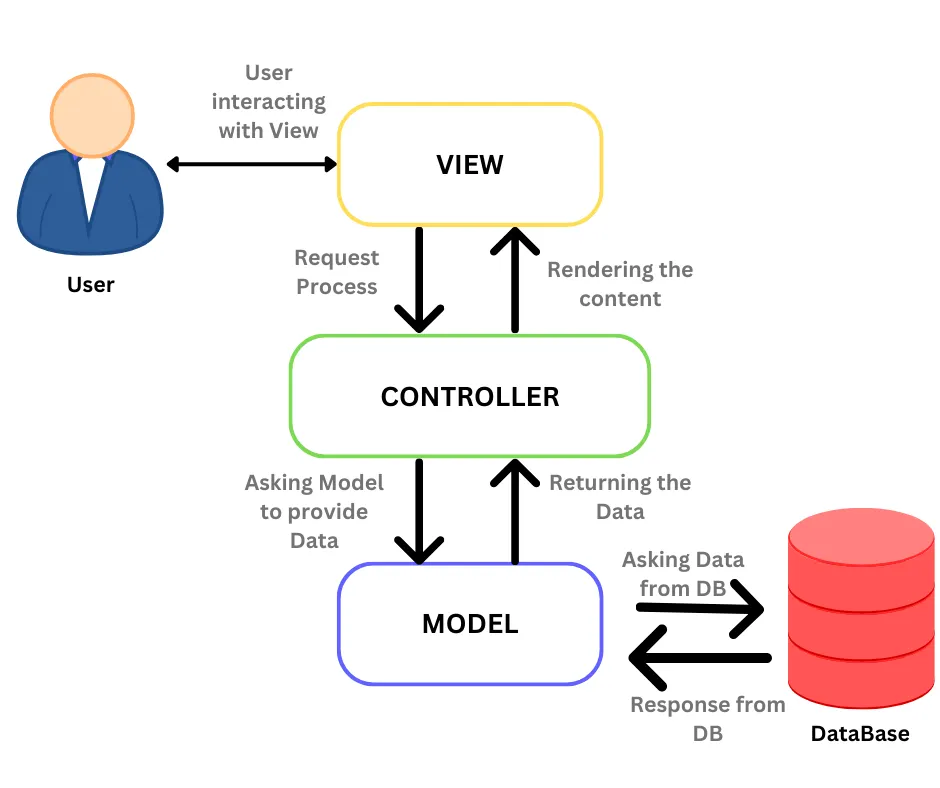

# Architecture Decision Record (ADR)

**ADR #:** 1  
**Title:** ADR for the Conductor application for Team 6 Fall 2025.   
**Date:** 20205-11-03  
**Status:** [Proposed | Accepted | Rejected | Superseded by ADR-XXX]

---

## 1. Context
The Conductor app is a collaborative platform for instructors, TAs, tutors, team leads, and students to manage course activities like attendance, journals, and group coordination. The current process relies on spreadsheets, Slack messages, and manual tracking which is inefficient for large classes. It becomes difficult to maintain accurate records and track participation for the teaching team.

The project must be completed within a five-week development timeline and follow technical and organizational standards. The system must be written in core web technologies for long-term support: standard HTML, CSS, and vanilla JavaScript. The backend will use Node.js with Express, connected to a PostgreSQL database, and Auth.js will handle authentication. Accessibility and internationalization are important as the platform should be usable by OSD students and international users. The app must handle 500 to 1000 simultaneous users and store tens of thousands of student records over time while maintaining strong performance on a low-cost instance.

Security and privacy are also key constraints. The system must comply with FERPA regulations, enforce roles and permissions, support UCSD authentication, and make sure all data is encrypted during transmission and at rest. Logging, monitoring, and audit trails must be included to protect user information. The platform must also be mobile friendly and easy to use across devices. Finally, development should follow good research and engineering practices by exploring evolutionary and moldable design principles that allow the system to adapt over time.

The current course coordination tools lack centralization and version control. Information about attendance, group structure, and communication are scattered across different platforms (Slack, Spreadsheets, etc) which causes data inconsistencies and additional work for staff. Conductor provides one unified interface for all course members, reducing confusion, improving transparency, and supporting future reuse by instructors in upcoming quarters.

---

## 2. Decision
The Conductor app will use standard HTML, CSS and JavaScript on the frontend with HTMX for simple interactivity without adding heavy frameworks. The backend will be built with Node.js and Express to handle routes, authentication and API requests. The database will use PostgreSQL which provides a clear and efficient structure for storing users, roles, attendance and journals.
These technologies were chosen to keep the system lightweight and easy to maintain. Using core web tools makes it simple for future instructors to set up without advanced technical knowledge. Node.js keeps the same language across frontend and backend so development stays consistent and easier to debug. Express gives enough flexibility for APIs without adding extra layers. PostgreSQL fits well for this project since it supports strong data relationships and long term reliability. This approach keeps the app fast to build, straightforward to update and sustainable for future use.

This decision solves the main problem by keeping the system simple and practical. The goal is to build something instructors can actually use and maintain without needing deep technical setup or cloud access. Using core technologies avoids the complexity of frameworks and external tools that often break or change over time. Node.js and Express give us control over the backend while still being easy to learn and PostgreSQL keeps all data in one place so nothing is lost or duplicated. HTMX helps make the site feel responsive without turning it into a large JavaScript application. Together these choices make Conductor reliable, accessible, and realistic to deploy each quarter while meeting all the course needs.

---

## 3. Alternatives Considered
- **Option 1:** Hosting - AWS Instance Hosting  
Using an AWS EC2 instance to host the Conductor app would provide strong scalability, reliability, and control over deployment. It allows for flexible configuration and can easily handle a large number of users as the system grows. However, this option introduces significant setup complexity for instructors who are not familiar with AWS. Each instructor would need to create an AWS account, configure security groups, manage keys, and deploy the server manually. This process is time-consuming and requires familiarity with AWS that teaching staff may not have. It also introduces potential costs for hosting and maintenance which makes it less practical for a system meant to be lightweight and easy to deploy each quarter.

- **Option 2:** Frontend - React Framework  
Using React would make it easier to reuse components and build a more dynamic user interface. It has a large community with strong documentation and a wide range of libraries that could speed up frontend development. However, adopting React introduces a dependency that conflicts with the project’s goal of long-term sustainability. Frameworks like React evolve quickly and future updates or deprecations could break compatibility or require major rewrites. Instructors or future maintainers who are not familiar with React would also face a learning curve which makes the system harder to maintain and deploy over time.

- **Option 3:** Backend - Django Framework with Python
Using Django for the backend would provide a well-structured framework with built-in tools for authentication, ORM, and admin management which can be used by our features. It could speed up development by reducing the amount of boilerplate code and enforcing consistent design patterns. However, Django uses Python which would make the stack inconsistent with the JavaScript-based frontend. This increases maintenance complexity and makes it harder for teams to share code or handle full-stack issues. It also goes against the project’s requirement to stay lightweight and rely on core technologies that can be easily set up and understood by future instructors.

- **Option 4:** HTML Linter - Pa11y  
Pa11y was chosen to automate accessibility testing. It allows the team to verify that pages meet WCAG accessibility standards so that students and instructors with disabilities can use the system easily and effectively. Other accessibility tools such as Axe or Lighthouse offer similar functionality but are more complex to configure or integrate into our automated workflow. Pa11y provides a command-line interface that makes it easy to configure GitHub Actions which allows accessibility checks to run during continuous integration without additional dependencies. It fits the project’s goal of keeping tools lightweight while still maintaining professional accessibility standards.

- **Option 5:** CSS Linter - Stylelint
For CSS linting, the team selected Stylelint, which is used for catching style inconsistencies and enforcing formatting rules. While there are few active alternatives for CSS linting, Stylelint stands out for its simple configuration and broad rule set. It can be integrated directly into GitHub workflows or run locally without needing large packages or build systems. Using Stylelint helps maintain consistent styling across the codebase and prevents small visual errors from accumulating.

- **Option 6:** JavaScript Linter - ESLint  
ESLint was selected as the JavaScript linter because of its ease to use and strong integration with most editors and CI/CD pipelines. Alternatives such as JSHint or StandardJS were considered, but they offer less control or customization. ESLint allows the team to define specific rules for code formatting, variable naming, and best practices while also detecting potential errors early in development. It integrates easily into GitHub Actions and Visual Studio Code which helps to enforce good coding standards without adding unnecessary overhead.

---

## 4. Consequences
Our proposed architecture provides a variety of benefits. First, application performance will be both higher and more consistent. Because we aren’t using many dependencies, there will be less for the user to download when opening the page. Additionally, there will be reduced technical debt, as the technologies we plan to use are standardized and widely supported. This will prevent framework deprecation in the future from breaking the application. Other developers will also be able to work on it in the future without needing to learn much more than standard web development skills.

There are a few trade-offs that come with our strategy. There will be more upfront design work, because we will be lacking the reusable components that come from using a framework like React. HTMX will also provide some learning curve to individuals on the team who have not used it before.

Utilization of HTMX will need to be reflected in the backend, since HTMX is hypermedia driven, so many API calls will return HTML fragments. Testing will need to be more thorough and at a lower level, because there will be no framework provided testing utilities. Deployment will be overall simpler due to the relative simplicity of the system. Utilization of HTMX will not affect the goal of progressive enhancement in our frontend, specifically because it is hypermedia driven. However, we will need to ensure that we utilize HTMX as well as we can, and avoid using vanilla JS when possible.

---

## 5. Implementation Notes
Key Design Patterns, Libraries, or Components
- Follow a Model-View-Controller (MVC)-like structure for clarity between logic and presentation.
- Frontend: uses standard HTML, CSS, and vanilla JS.
- Backend: Node.js + Express for RESTful routes, Auth.js for Google OAuth authentication, and PostgreSQL for relational data (users, roles, attendance, journals).
- Security handled via middleware-based role access control (RBAC) and encrypted tokens.
- All code will follow ESLint, CSS, and HTML linting standards enforced through CI.

Rollout Plan / Migration Strategy
- Development and testing will run inside Docker containers for consistent environments across all team members. Environment variables (for database credentials and API keys) will be managed through .env files inside the Docker setup.
- Each feature branch is merged only after review and passing linting checks and tests.
- Database migration will be handled through versioned SQL scripts and seeded data.
- After all features integrate successfully, deployment will use a lightweight, easily portable setup without any AWS or Terraform configuration, following the professor’s requirement for simple and quick deployment.

Monitoring, Testing, or Fallback Considerations
- Testing will focus on unit tests for backend routes and integration tests for frontend-backend interactions.
- Each feature team is responsible for testing their modules before merging; a separate testing team performs cross-feature verification.
- Automated tests and lint checks will run through GitHub Actions before merges.
- Logs and activity tracking will record all API events to aid in debugging and auditing.
- Weekly manual QA sessions will check accessibility, responsiveness, and user workflows across roles (Instructor, TA, Student).
- Regular backups will be taken for the PostgreSQL database, and rollback to the previous stable build will be used as the fallback strategy.

---

## 6. References
- [Design doc link](https://github.com/CSE210-fa25-team06/conductor-app/blob/main/specs/pitch/design-spec.pdf)
- Database mappings are located in our [github repository](https://github.com/CSE210-fa25-team06/conductor-app/tree/main/specs/pitch)
- Systems diagrams for the general architecture and for each feature are located in our [github repository](https://github.com/CSE210-fa25-team06/conductor-app/tree/main/specs/pitch)
- [Model View Controller Beginner's Guide](https://medium.com/@kasuniwijesiri2002/a-beginners-guide-to-understanding-mvc-architecture-in-web-development-c23b9a266171)
